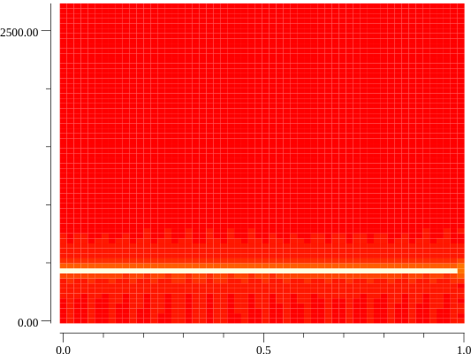
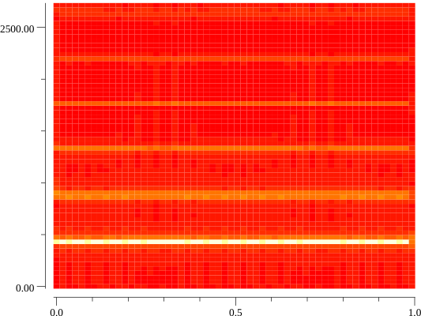
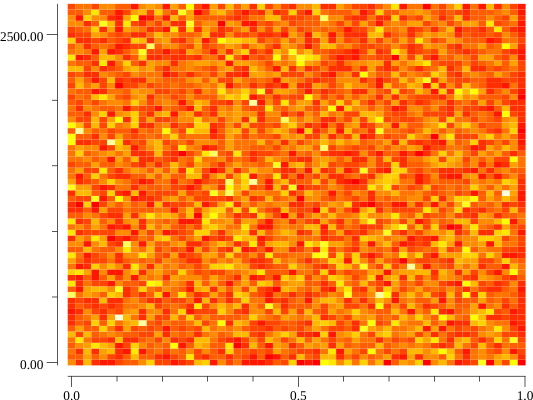
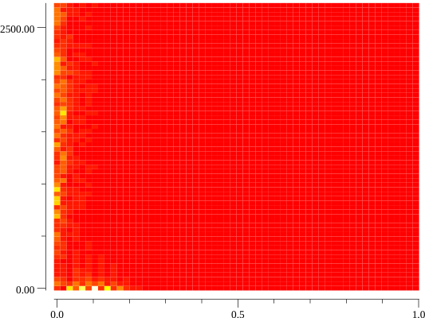
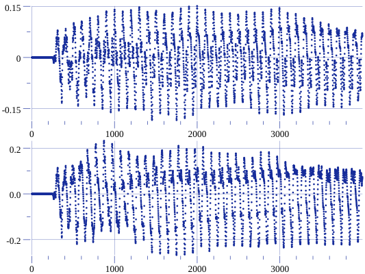
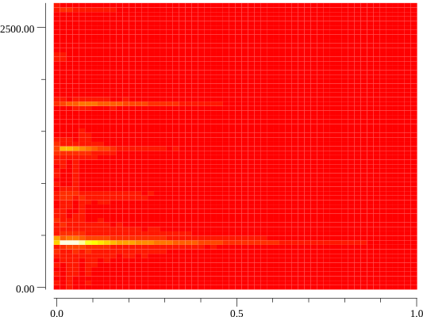
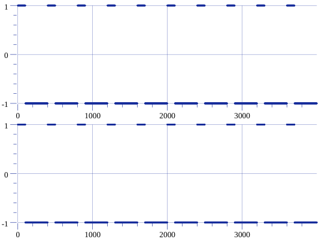
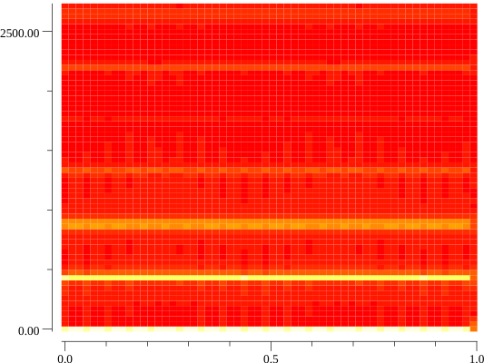

# Example plots

## Sine 


```
package main 

import (
    "github.com/bspaans/bleep/audio"
    "github.com/bspaans/bleep/generators"
)

func main() {
    cfg := audio.NewAudioConfig()
    g := generators.NewSineWaveOscillator()
    g.SetPitch(110.0)
    g.GetSamples(cfg, 4000)
}

```



## Square 


```
package main 

import (
    "github.com/bspaans/bleep/audio"
    "github.com/bspaans/bleep/generators"
)

func main() {
    cfg := audio.NewAudioConfig()
    g := generators.NewSquareWaveOscillator()
    g.SetPitch(110.0)
    g.GetSamples(cfg, 4000)
}


```


## Triangle 


```
package main 

import (
    "github.com/bspaans/bleep/audio"
    "github.com/bspaans/bleep/generators"
)

func main() {
    cfg := audio.NewAudioConfig()
    g := generators.NewTriangleWaveOscillator()
    g.SetPitch(110.0)
    g.GetSamples(cfg, 4000)
}

```


## Saw 


```
package main 

import (
    "github.com/bspaans/bleep/audio"
    "github.com/bspaans/bleep/generators"
)

func main() {
    cfg := audio.NewAudioConfig()
    g := generators.NewSawtoothWaveOscillator()
    g.SetPitch(110.0)
    g.GetSamples(cfg, 4000)
}

```



## White noise 


```
package main 

import (
    "github.com/bspaans/bleep/audio"
    "github.com/bspaans/bleep/generators"
)

func main() {
    cfg := audio.NewAudioConfig()
    g := generators.NewWhiteNoiseGenerator()
    g.GetSamples(cfg, 4000)
}

```



## .wav sample (clap.wav)


```
package main 

import (
    "github.com/bspaans/bleep/audio"
    "github.com/bspaans/bleep/generators"
)

func main() {
    cfg := audio.NewAudioConfig()
    g := generators.NewWavGenerator("examples/test.wav")
    g.GetSamples(cfg, 4000)
}

```



## .wav sample (piano.wav)





## Pulse (25% duty cycle)




```
package main 

import (
    "github.com/bspaans/bleep/audio"
    "github.com/bspaans/bleep/generators"
)

func main() {
    cfg := audio.NewAudioConfig()
    g := generators.NewPulseWaveGenerator(0.25, nil, 0.0)
    g.GetSamples(cfg, 4000)
}

```



